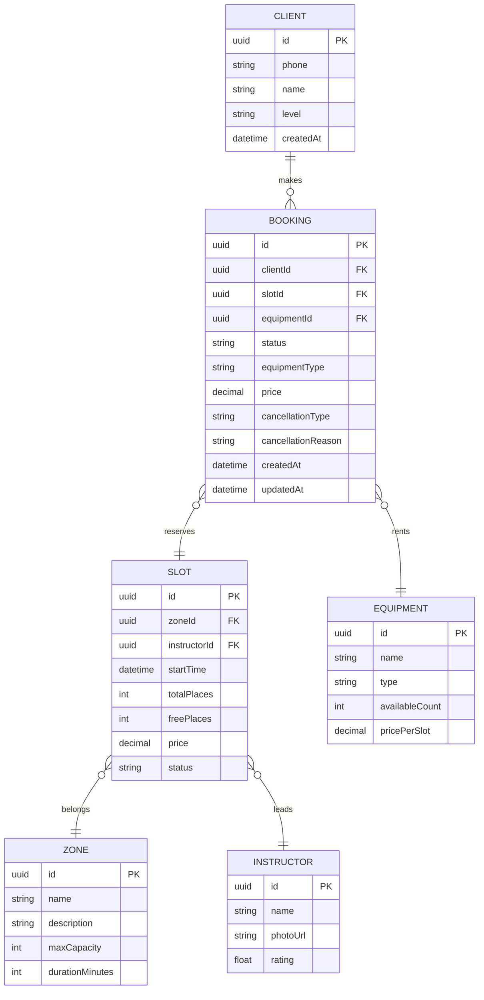

# Дизайн системы

## 1. ER-модель (Mermaid)

## 2. Описание сущностей

### Сущности, доступные только для чтения (READ-ONLY)

Эти данные приходят из бэкенда и не модифицируются клиентским приложением:

| Сущность | Описание | Источник |
| :-- | :-- | :-- |
| **Slot** | Тренировка: дата/время старта, зона, инструктор, всего и свободно мест. Создаётся в существующей инфраструктуре. | API GET /slots |
| **Zone** | Зона тренировки: болдеринг (потолок 8) или трассы с верёвкой (потолок 16). Справочные данные. | API GET /zones |
| **Instructor** | Инструктор, ведущий тренировку. Справочные данные с рейтингом. | API GET /instructors |
| **Equipment** | Снаряжение для проката: скальники, страховочная система, обувь. | API GET /equipment |

### Сущности с операциями CRUD

| Сущность | Операции | Описание |
| :-- | :-- | :-- |
| **Client** | CREATE (регистрация), READ (профиль) | Клиент скалодрома. Регистрация по телефону. |
| **Booking** | CREATE, READ (свои), UPDATE (отмена) | Бронирование места на тренировку. |

## 3. Статусы бронирования

| Статус | Описание |
| :-- | :-- |
| `confirmed` | Бронирование подтверждено |
| `cancelled_by_client_early` | Отменено клиентом бесплатно (≥2ч до старта) |
| `cancelled_by_client_late` | Отменено клиентом со штрафом (<2ч до старта) |
| `cancelled_by_gym` | Отменено скалодромом (причина в `cancellationReason`) |

## 4. Политика отмены

- **Бесплатная отмена**: не позднее 2 часов до старта тренировки
- **Штрафная отмена**: менее 2 часов — штраф 10% от стоимости
- **Отмена скалодромом**: бронь получает статус `cancelled_by_gym`, клиент получает push-уведомление, повторная запись запрещена