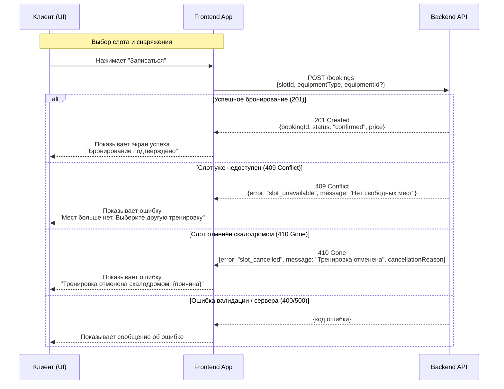

# Sequence-диаграмма: createBooking

## Диаграмма (Mermaid)

## Описание сценариев

### Успешное бронирование (201 Created)

1. Клиент выбирает тренировку (слот) и опционально снаряжение на прокат
2. Нажимает кнопку "Записаться"
3. Frontend отправляет POST-запрос на создание брони
4. Бэкенд:
   - Проверяет доступность слотов (атомарно)
   - Проверяет лимит прокатного фонда (если выбрано снаряжение)
   - Создаёт бронирование со статусом `confirmed`
   - Уменьшает счётчик freePlaces
5. Возвращает 201 с данными брони
6. Frontend показывает экран успеха с подтверждением

### Слот недоступен (409 Conflict)

1. Бэкенд проверяет слот и обнаруживает, что freePlaces = 0
2. Возвращает 409 Conflict с кодом ошибки `slot_unavailable`
3. Frontend показывает сообщение "Нет свободных мест" и предлагает выбрать другую тренировку

### Слот отменён скалодромом (410 Gone)

1. Бэкенд проверяет слот и обнаруживает, что статус = `cancelled`
2. Возвращает 410 Gone с кодом `slot_cancelled` и причиной отмены
3. Frontend показывает: "Тренировка отменена скалодромом: {причина}"
4. Кнопка записи на этот слот недоступна (деактивирована)

## Коды HTTP-ответов

| Код | Условие |
| :-- | :-- |
| 201 | Бронирование успешно создано |
| 409 | Слот существует, но мест нет (или нет нужного снаряжения) |
| 410 | Слот отменён скалодромом, повторная запись запрещена |
| 400 | Ошибка валидации данных |
| 401 | Не авторизован |
| 500 | Внутренняя ошибка сервера |