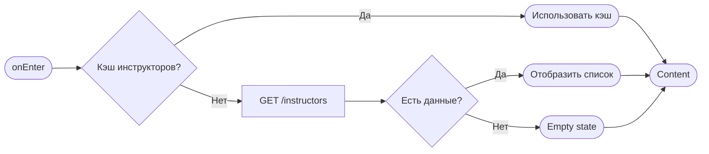

# Фильтры

**ID:** BS-01  
**Тип:** Bottom Sheet  
**Домен:** 04. Компоненты  
**Приоритет:** High  
**Статус:** Готов к дизайну  
**Функциональные блоки:** FB-01-001, FB-01-002, FB-01-003  
**Зона авторизации:** НЗ + АЗ  
**Дизайн-макет:** [Figma](https://figma.com) — версия 1.0

---

## Содержание

- [История изменений](#история-изменений)
- [Обзор](#обзор)
- [Навигация](#навигация)
- [Входные данные](#входные-данные)
- [Применяемые логики](#применяемые-логики)
- [Свойства Bottom Sheet](#свойства-bottom-sheet)
- [Инициализация](#инициализация)
- [Используемые запросы](#используемые-запросы)
- [Макет экрана](#макет-экрана)
- [Элементы экрана](#элементы-экрана)
- [Состояния экрана](#состояния-экрана)
- [Действия пользователя](#действия-пользователя)
- [Связанные требования](#связанные-требования)
- [Критерии приёмки](#критерии-приёмки)

---

## История изменений

| Релиз | ТЗ | Описание изменений |
|-------|-----|-------------------|
| 1.0.0 | BS-01 | Первая версия ТЗ |

---

## Обзор

Bottom Sheet для фильтрации слотов на главном экране веб-приложения скалодрома «Вертикаль». Пользователь открывает окно по клику на кнопку фильтров, выбирает критерии и применяет их для отображения подходящих слотов.

### User Story

> Как **посетитель скалодрома**, я хочу **фильтровать слоты по зоне, дате, наличию мест и инструктору**, чтобы **быстро найти подходящее время и место для тренировки**.

### Бизнес-ценность

- Улучшение пользовательского опыта при поиске слотов
- Увеличение конверсии бронирований за счёт удобного поиска
- Снижение нагрузки на службу поддержки
- Повторные визиты благодаря удобству фильтрации

---

## Навигация

### Входящая (откуда открывается)

| Источник | Триггер | Условие | Передаваемые параметры |
|----------|---------|---------|------------------------|
| [SCR-01 Главный экран](SCR-01_Главный_экран.md) | Тап на кнопку фильтров | Всегда | — |

### Исходящая (куда ведёт)

| Назначение | Триггер | Передаваемые параметры |
|------------|---------|------------------------|
| [SCR-01 Главный экран](SCR-01_Главный_экран.md) | Применение фильтров | `{filters}` |

---

## Входные данные

| Название | Тип | Возможные значения | Описание |
|----------|-----|-------------------|----------|
| `zones` | Remote Config | `boulder`, `rope`, `all` | Список доступных зон |
| `instructors` | Кэш | Список инструкторов | Кэш списка инструкторов |
| `selectedFilters` | Состояние | Объект фильтров | Текущие выбранные фильтры |

---

## Применяемые логики

> *Секция опциональна. Указывать, если на экране используется переиспользуемая бизнес-логика из раздела [Логики](Логики/_INDEX.md).*

---

## Свойства Bottom Sheet

| Свойство | Значение |
|----------|----------|
| Высота | Динамическая (max 80vh с внутренним скроллом) |
| Закрытие свайпом | Да |
| Закрытие по тапу вне области | Да |
| Затемнение фона | Да |
| Кнопка закрытия | Да (справа в header) |

---

## Инициализация

> **Примечание:** Если при открытии экрана не отправляются запросы (данные берутся из кэша), укажите это в таблице запросов и опишите источники данных во [Входных данных](#входные-данные).

### Диаграмма загрузки



### Запросы при открытии

| № | Запрос | Критичный | Зависит от | Условие |
|---|--------|-----------|------------|---------|
| 1 | [GET /instructors](#get-instructors) | Нет | — | Кэш пуст |
| 2 | [GET /zones](#get-zones) | Нет | — | Кэш пуст |

---

## Используемые запросы

### GET /instructors

**Тип:** REST  
**Метод:** GET  
**Спецификация:** `instructors.yaml` → `getInstructors`

**Триггер:** Инициализация (если нет в кэше)

**Параметры:**

| Параметр | Тип | Обязательность | Источник | Описание |
|----------|-----|----------------|----------|----------|
| `zone` | string | Нет | UI | Фильтр по зоне |

**Обработка ответа:**

| Результат | Условие | UI-реакция |
|-----------|---------|------------|
| Загрузка | — | Скелетон списка (3 строки) |
| Успех | `data` не пуст | Отобразить список инструкторов |
| Успех | `data` пуст | Текст «Нет доступных инструкторов» |
| HTTP 4xx | — | Error state с кнопкой "Повторить" |
| HTTP 5xx | — | Error state с кнопкой "Повторить" |
| Сеть | Нет соединения | Error state с кнопкой "Повторить" |

---

### GET /zones

**Тип:** REST  
**Метод:** GET  
**Спецификация:** `zones.yaml` → `getZones`

**Триггер:** Инициализация (если нет в кэше)

**Обработка ответа:**

| Результат | Условие | UI-реакция |
|-----------|---------|------------|
| Загрузка | — | Скелетон сегментов |
| Успех | `data` не пуст | Отобразить зоны |
| Успех | `data` пуст | Скрыть секцию |
| HTTP 4xx/5xx | — | Скрыть секцию |

---

### GET /slots

**Тип:** REST  
**Метод:** GET  
**Спецификация:** `slots.yaml` → `getSlots`

**Триггер:** Применение фильтров (нажатие кнопки «Применить»)

**Параметры:**

| Параметр | Тип | Обязательность | Источник | Описание |
|----------|-----|----------------|----------|----------|
| `zone` | string | Нет | UI (фильтр) | Фильтр по зоне |
| `date` | string | Нет | UI (фильтр) | Фильтр по дате |
| `dateFrom` | string | Нет | UI (фильтр) | Дата начала периода |
| `dateTo` | string | Нет | UI (фильтр) | Дата окончания периода |
| `instructorId` | string | Нет | UI (фильтр) | ID инструктора |
| `onlyAvailable` | boolean | Нет | UI (фильтр) | Только со свободными местами |

**Обработка ответа:**

| Результат | Условие | UI-реакция |
|-----------|---------|------------|
| Загрузка | — | Лоадер на кнопке |
| Успех | `data` не пуст | Закрыть BS, обновить список |
| Успех | `data` пуст | Показать «Нет доступных слотов» |
| HTTP 4xx | — | Снек с текстом ошибки |
| HTTP 5xx | — | Снек «Произошла ошибка. Попробуйте позже» |
| Сеть | Нет соединения | Снек «Нет соединения. Проверьте подключение» |

---

## Макет экрана

### Структура

```
┌─────────────────────────────────────┐
│ [←] Заголовок              [X]     │  ← Header
├─────────────────────────────────────┤
│                                     │
│  Зона                               │  ← Scrollable
│  [Все] [Болдеринг] [Трассы]        │
│                                     │
│  Дата                               │
│  [Сегодня] [Завтра] [Неделя] [📅]  │
│                                     │
│  ☑ Только со свободными местами    │
│                                     │
│  Инструктор                         │
│  ○ Иван Петров        ★ 4.8        │
│  ○ Анна Сидорова      ★ 4.9        │
│                                     │
├─────────────────────────────────────┤
│  [Сбросить]        [Применить]     │  ← Fixed Bottom
└─────────────────────────────────────┘
```

### Компоненты

| Компонент | Описание | Обязательность |
|-----------|----------|----------------|
| Header | Заголовок с иконкой закрытия | Да |
| Segmented Control (Зона) | Переключатель зон | Да |
| Segmented Control (Дата) | Переключатель дат + Date Picker | Да |
| Checkbox | Фильтр по наличию мест | Да |
| Radio List | Выбор инструктора | Да |
| Footer | Кнопки действий | Да |

---

## Элементы экрана

> **Примечания:**
> - **Колонка "Валидация":** Для полей ввода указать правило и текст ошибки. Для остальных элементов — "—".
> - **Логика:** Описывается после таблицы каждого блока в виде текстового блока "**Логика:**". Если элемент использует переиспользуемую логику из раздела [Логики](Логики/_INDEX.md), укажите ссылку на неё.
> - **Условия доступности:** Для кнопок и интерактивных элементов указать условия активности/видимости после таблицы.

### 1. Header

| Элемент | Описание | Источник данных | Валидация | Действие |
|---------|----------|-----------------|-----------|----------|
| Заголовок «Фильтры» | Текст заголовка | Статический | — | — |
| Счётчик активных | Бейдж с количеством | `activeFiltersCount` из состояния | — | — |
| Кнопка закрытия | Иконка ✕ | — | — | Закрыть Bottom Sheet |

**Логика:**
- Счётчик активных: Отображает количество выбранных фильтров, если > 0

### 2. Фильтр «Зона»

| Элемент | Описание | Источник данных | Валидация | Действие |
|---------|----------|-----------------|-----------|----------|
| Segmented Control | Переключатель зон | `zones` из API | — | Переключение фильтра |

**Логика:**
- Segmented Control: [LOGIC-001](../Логики/LOGIC-001_SegmentedControl.md) — переключение сегментов с анимацией

**Условия доступности:**
- Все сегменты активны

### 3. Фильтр «Дата»

| Элемент | Описание | Источник данных | Валидация | Действие |
|---------|----------|-----------------|-----------|----------|
| Segmented Control | Переключатель дат | Статический | — | Переключение |
| Date Picker | Выбор даты | — | — | Открыть календарь |

**Логика:**
- Segmented Control: При выборе «Неделя» — автоматический расчёт dateFrom/dateTo
- Date Picker: При выборе даты — сегмент «Неделя» деактивируется

### 4. Фильтр «Места»

| Элемент | Описание | Источник данных | Валидация | Действие |
|---------|----------|-----------------|-----------|----------|
| Checkbox | Фильтр по местам | `onlyAvailable` из состояния | — | Переключение |

**Логика:**
- Checkbox: [LOGIC-002](../Логики/LOGIC-002_Checkbox.md) — переключение с анимацией

### 5. Фильтр «Инструктор»

| Элемент | Описание | Источник данных | Валидация | Действие |
|---------|----------|-----------------|-----------|----------|
| Radio List | Выбор инструктора | `instructors` из API | — | Выбор одного |
| Элемент списка | Инструктор с рейтингом | `instructor.name`, `instructor.rating` | — | Выбор |

**Логика:**
- Radio List: [LOGIC-003](../Логики/LOGIC-003_RadioList.md) — одиночный выбор

**Условия доступности:**
- Элемент списка: активен, если `instructor.available = true`
- Элемент списка: загружен

### 6. Footer

| Элемент | Описание | Источник данных | Валидация | Действие |
|---------|----------|-----------------|-----------|----------|
| Кнопка «Сбросить» | Text Button | — | — | Сброс всех фильтров |
| Кнопка «Применить» | Primary Button | — | — | Применить фильтры → GET /slots |

**Логика:**
- Кнопка «Сбросить»: Сбрасывает все фильтры в состояние по умолчанию
- Кнопка «Применить»: Собирает текущие значения фильтров → отправляет GET /slots → закрывает BS

**Условия доступности:**
- Кнопка «Сбросить» активна, если: есть хотя бы один активный фильтр
- Кнопка «Применить» активна, если: всегда

---

## Состояния экрана

### Таблица состояний

| Состояние | Условие | Отображение |
|-----------|---------|-------------|
| Loading | Ожидание API | Скелетон-шиммер |
| Content | API 200 + data | Стандартный контент |
| Empty (инструкторы) | API 200 + empty | Текст «Нет доступных инструкторов» |
| No Results | API 200 + empty slots | «Нет доступных слотов» |
| Error | API 4xx/5xx | Error state с кнопкой "Повторить" |


## Действия пользователя

| Действие | Элемент | Триггер | Результат |
|----------|---------|---------|-----------|
| Закрыть | Кнопка ✕ | Tap | Закрытие Bottom Sheet |
| Закрыть | Backdrop | Tap | Закрытие Bottom Sheet |
| Закрыть | Свайп вниз | Swipe | Закрытие Bottom Sheet |
| Переключить | Сегмент (Зона) | Tap | Обновление фильтра |
| Переключить | Сегмент (Дата) | Tap | Обновление фильтра |
| Переключить | Checkbox | Tap | Обновление фильтра |
| Выбрать | Инструктор | Tap | Выбор одного инструктора |
| Сбросить | Кнопка «Сбросить» | Tap | Сброс всех фильтров |
| Применить | Кнопка «Применить» | Tap | Запрос слотов → закрытие |

---

## Связанные требования

### Функциональные (REQ-FUNC-*)

| ID | Название | Приоритет |
|----|----------|-----------|
| FT-05 | Фильтр по зоне: болдеринг / трассы с верёвкой / все | High |
| FT-06 | Фильтр по дате: сегодня / завтра / эта неделя / выбрать дату | High |
| FT-07 | Фильтр по наличию мест: только со свободными местами | High |
| FT-08 | Фильтр по инструктору: список инструкторов с рейтингом | Medium |

---

## Критерии приёмки

### Позитивные сценарии

| ID | Критерий | Приоритет |
|----|----------|-----------|
| AC-001 | **Дано** пользователь на главном экране, **Когда** нажимает кнопку фильтров, **Тогда** открывается Bottom Sheet с фильтрами | P0 |
| AC-002 | **Дано** Bottom Sheet открыт, **Когда** выбирает зону «Болдеринг», **Тогда** фильтр применяется | P0 |
| AC-003 | **Дано** Bottom Sheet открыт, **Когда** нажимает «Применить», **Тогда** фильтры применяются и список слотов обновляется | P0 |
| AC-004 | **Дано** выбраны фильтры, **Когда** нажимает «Сбросить», **Тогда** все фильтры сбрасываются | P1 |

### Негативные сценарии

| ID | Критерий | Приоритет |
|----|----------|-----------|
| AC-N01 | **Дано** ошибка сети при загрузке инструкторов, **Когда** открытие BS, **Тогда** отображается error state с кнопкой «Повторить» | P0 |
| AC-N02 | **Дано** нет доступных слотов после фильтрации, **Когда** нажатие «Применить», **Тогда** показывается сообщение «Нет доступных слотов» | P1 |

### Граничные условия (Edge Cases)

| ID | Критерий | Приоритет |
|----|----------|-----------|
| AC-E01 | **Дано** все фильтры сброшены, **Когда** нажатие «Применить», **Тогда** показываются все доступные слоты | P1 |
| AC-E02 | **Дано** выбрана дата в прошлом, **Когда** выбор даты, **Тогда** дата в прошлом не выбирается | P1 |