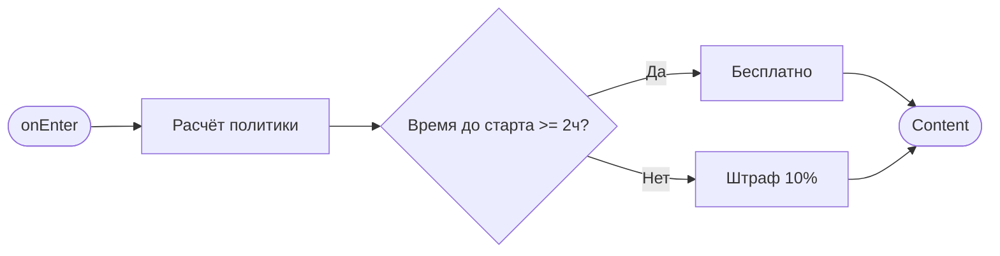

# Подтверждение отмены бронирования

**ID:** BS-02  
**Тип:** Bottom Sheet  
**Домен:** 04. Компоненты  
**Приоритет:** High  
**Статус:** Готов к дизайну  
**Функциональные блоки:** FB-02-001, FB-02-002  
**Зона авторизации:** АЗ  
**Дизайн-макет:** [Figma](https://figma.com) — версия 1.0

---

## Содержание

- [История изменений](#история-изменений)
- [Обзор](#обзор)
- [Навигация](#навигация)
- [Входные данные](#входные-данные)
- [Применяемые логики](#применяемые-логики)
- [Свойства Bottom Sheet](#свойства-bottom-sheet)
- [Инициализация](#инициализация)
- [Используемые запросы](#используемые-запросы)
- [Макет экрана](#макет-экрана)
- [Элементы экрана](#элементы-экрана)
- [Состояния экрана](#состояния-экрана)
- [Действия пользователя](#действия-пользователя)
- [Связанные требования](#связанные-требования)
- [Критерии приёмки](#критерии-приёмки)

---

## История изменений

| Релиз | ТЗ | Описание изменений |
|-------|-----|-------------------|
| 1.0.0 | BS-02 | Первая версия ТЗ |

---

## Обзор

Bottom Sheet подтверждения отмены бронирования. Пользователь видит предупреждение и условия политики отмены перед подтверждением отмены.

### User Story

> Как **посетитель скалодрома**, я хочу **подтвердить отмену бронирования**, чтобы **отменить запись на занятие с учётом условий политики**.

### Бизнес-ценность

- Информирование пользователя о финансовых последствиях отмены
- Снижение количества импульсивных отмен
- Прозрачность условий политики отмены

---

## Навигация

### Входящая (откуда открывается)

| Источник | Триггер | Условие | Передаваемые параметры |
|----------|---------|---------|------------------------|
| [SCR-06 Детали бронирования](SCR-06_Детали_бронирования.md) | Тап на кнопку «Отменить» | Всегда | `{bookingId}`, `{slotStartTime}` |

### Исходящая (куда ведёт)

| Назначение | Триггер | Передаваемые параметры |
|------------|---------|------------------------|
| [SCR-06 Детали бронирования](SCR-06_Детали_бронирования.md) | Успешная отмена | — |

---

## Входные данные

| Название | Тип | Возможные значения | Описание |
|----------|-----|-------------------|----------|
| `bookingId` | Параметр навигации | UUID | ID бронирования |
| `slotStartTime` | Параметр навигации | ISO datetime | Время начала слота |
| `price` | Состояние | number | Стоимость бронирования |

---

## Применяемые логики

> *Секция опциональна. Указывать, если на экране используется переиспользуемая бизнес-логика из раздела [Логики](Логики/_INDEX.md).*

---

## Свойства Bottom Sheet

| Свойство | Значение |
|----------|----------|
| Высота | Фиксированная |
| Закрытие свайпом | Нет |
| Закрытие по тапу вне области | Да |
| Затемнение фона | Да |
| Кнопка закрытия | Да (справа в header) |

---

## Инициализация

> **Примечание:** При открытии экрана не отправляются запросы. Данные берутся из входных параметров.

### Диаграмма загрузки



### Запросы при открытии

| № | Запрос | Критичный | Зависит от | Условие |
|---|--------|-----------|------------|---------|
| 1 | — | — | — | Нет запросов (расчёт локальный) |

---

## Используемые запросы

### PATCH /bookings/{bookingId}/cancel

**Тип:** REST  
**Метод:** PATCH  
**Спецификация:** `bookings.yaml` → `cancelBooking`

**Триггер:** Тап на кнопку «Отменить»

**Параметры:**

| Параметр | Тип | Обязательность | Источник | Описание |
|----------|-----|----------------|----------|----------|
| `bookingId` | string | Да | Входные данные | ID бронирования |

**Обработка ответа:**

| Результат | Условие | UI-реакция |
|-----------|---------|------------|
| Загрузка | — | Спиннер на кнопке «Отменить» |
| Успех | — | Закрыть BS, показать снекбар |
| HTTP 4xx | `message` содержит текст | Снек с текстом из `message` |
| HTTP 5xx | — | Снек «Произошла ошибка. Попробуйте позже» |
| Сеть | Нет соединения | Снек «Нет соединения. Проверьте подключение» |

---

## Макет экрана

### Структура

```
┌─────────────────────────────────────┐
│ [←] Подтверждение отмены    [X]    │  ← Header
├─────────────────────────────────────┤
│                                     │
│              ⚠️                      │  ← Scrollable
│         (иконка)                    │
│                                     │
│    Вы уверены, что хотите           │
│       отменить запись?              │
│                                     │
│  ─────────────────────────────────  │
│                                     │
│     Политика отмены:               │
│     • Бесплатно, если отмена ≥2ч   │
│     • Штраф 10%, если отмена <2ч   │
│                                     │
│     Сумма к оплате: 500 ₽          │  ← Показывается при штрафе
│                                     │
├─────────────────────────────────────┤
│  [Не отменять]   [Отменить]        │  ← Fixed Bottom
│   (Secondary)     (Primary, red)   │
└─────────────────────────────────────┘
```

### Компоненты

| Компонент | Описание | Обязательность |
|-----------|----------|----------------|
| Header | Заголовок с иконкой закрытия | Да |
| Иконка предупреждения | Статическая иконка 48×48px | Да |
| Текст вопроса | Заголовок с сообщением | Да |
| Разделитель | Горизонтальная линия | Да |
| Блок политики | Условия политики отмены | Да |
| Итоговая сумма | Сумма штрафа (conditional) | Опционально |
| Footer | Кнопки действий | Да |

---

## Элементы экрана

> **Примечания:**
> - **Колонка "Валидация":** Для полей ввода указать правило и текст ошибки. Для остальных элементов — "—".
> - **Логика:** Описывается после таблицы каждого блока в виде текстового блока "**Логика:**". Если элемент использует переиспользуемую логику из раздела [Логики](Логики/_INDEX.md), укажите ссылку на неё.
> - **Условия доступности:** Для кнопок и интерактивных элементов указать условия активности/видимости после таблицы.

### 1. Header

| Элемент | Описание | Источник данных | Валидация | Действие |
|---------|----------|-----------------|-----------|----------|
| Заголовок | Текст «Подтверждение отмены» | Статический | — | — |
| Кнопка закрытия | Иконка ✕ | — | — | Закрыть Bottom Sheet |

### 2. Основной контент

| Элемент | Описание | Источник данных | Валидация | Действие |
|---------|----------|-----------------|-----------|----------|
| Иконка предупреждения | Иконка ⚠️ | Статическая | — | — |
| Текст вопроса | Заголовок | Статический | — | — |
| Разделитель | Горизонтальная линия | — | — | — |
| Политика отмены | Список условий | Локальный расчёт | — | — |
| Сумма штрафа | Текст | Расчёт: `price * 0.1` | — | — |

**Логика:**
- Политика отмены: Расчёт времени до старта = `slot.startTime - now`
- Если время ≥ 2 часа → бесплатно, если < 2 часа → штраф 10%
- Сумма штрафа отображается только при наличии штрафа

**Условия доступности:**
- Блок «Сумма штрафа» виден, если: `время до старта < 2 часа`

### 3. Footer

| Элемент | Описание | Источник данных | Валидация | Действие |
|---------|----------|-----------------|-----------|----------|
| Кнопка «Не отменять» | Secondary Button | — | — | Закрыть BS |
| Кнопка «Отменить» | Primary Button (#F44336) | — | — | PATCH /bookings/{id}/cancel |

**Логика:**
- Кнопка «Отменить»: [LOGIC-004](../Логики/LOGIC-004_DestructiveAction.md) — деструктивное действие с подтверждением

**Условия доступности:**
- Кнопка «Отменить» активна, если: всегда

---

## Состояния экрана

### Таблица состояний

| Состояние | Условие | Отображение |
|-----------|---------|-------------|
| Без штрафа | ≥2 часа до старта | Текст «Бесплатно», кнопка «Отменить» |
| Со штрафом | <2 часа до старта | Сумма штрафа, кнопка «Отменить» |
| Загрузка | Ожидание ответа API | Спиннер на кнопке «Отменить» |
| Успех | Отмена подтверждена | Закрытие BS, показ снекбара |


## Действия пользователя

| Действие | Элемент | Триггер | Результат |
|----------|---------|---------|-----------|
| Закрыть | Кнопка ✕ | Tap | Закрытие Bottom Sheet |
| Закрыть | Backdrop | Tap | Закрытие Bottom Sheet |
| Отменить действие | Кнопка «Не отменять» | Tap | Закрытие Bottom Sheet |
| Подтвердить отмену | Кнопка «Отменить» | Tap | PATCH /bookings/{id}/cancel |

---

## Связанные требования

### Функциональные (REQ-FUNC-*)

| ID | Название | Приоритет |
|----|----------|-----------|
| FT-15 | Политика отмены бронирований | High |
| FT-16 | Процесс отмены бронирования | High |

---

## Критерии приёмки

### Позитивные сценарии

| ID | Критерий | Приоритет |
|----|----------|-----------|
| AC-001 | **Дано** пользователь на экране деталей бронирования, **Когда** нажимает «Отменить», **Тогда** открывается BS с подтверждением | P0 |
| AC-002 | **Дано** BS подтверждения открыт, **Когда** нажимает «Отменить» при времени ≥2ч до старта, **Тогда** бронь отменяется бесплатно | P0 |
| AC-003 | **Дано** BS подтверждения открыт, **Когда** нажимает «Не отменять», **Тогда** BS закрывается, бронь не отменяется | P0 |

### Негативные сценарии

| ID | Критерий | Приоритет |
|----|----------|-----------|
| AC-N01 | **Дано** ошибка сети при отмене, **Когда** нажатие «Отменить», **Тогда** отображается снек об ошибке | P0 |
| AC-N02 | **Дано** время <2ч до старта, **Когда** открытие BS, **Тогда** отображается сумма штрафа | P1 |

### Граничные условия (Edge Cases)

| ID | Критерий | Приоритет |
|----|----------|-----------|
| AC-E01 | **Дано** точное время 2 часа до старта, **Когда** расчёт, **Тогда** отмена бесплатная | P1 |
| AC-E02 | **Дано** пользователь закрыл BS и повторно открыл, **Когда** проверка, **Тогда** политика пересчитывается | P1 |