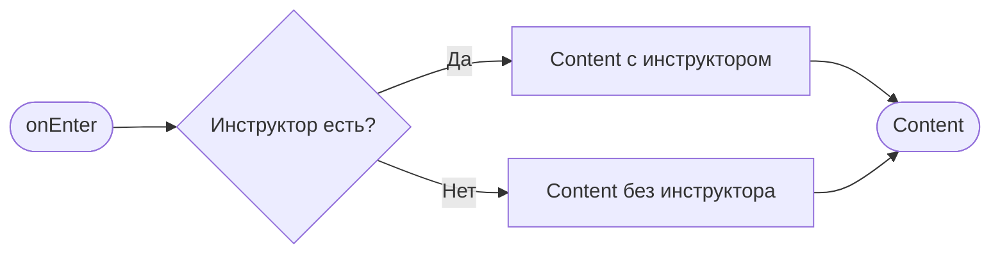

# Успешное бронирование

**ID:** BS-03  
**Тип:** Bottom Sheet  
**Домен:** 04. Компоненты  
**Приоритет:** High  
**Статус:** Готов к дизайну  
**Функциональные блоки:** FB-03-001, FB-03-002  
**Зона авторизации:** АЗ  
**Дизайн-макет:** [Figma](https://figma.com) — версия 1.0

---

## Содержание

- [История изменений](#история-изменений)
- [Обзор](#обзор)
- [Навигация](#навигация)
- [Входные данные](#входные-данные)
- [Применяемые логики](#применяемые-логики)
- [Свойства Bottom Sheet](#свойства-bottom-sheet)
- [Инициализация](#инициализация)
- [Используемые запросы](#используемые-запросы)
- [Макет экрана](#макет-экрана)
- [Элементы экрана](#элементы-экрана)
- [Состояния экрана](#состояния-экрана)
- [Действия пользователя](#действия-пользователя)
- [Связанные требования](#связанные-требования)
- [Критерии приёмки](#критерии-приёмки)

---

## История изменений

| Релиз | ТЗ | Описание изменений |
|-------|-----|-------------------|
| 1.0.0 | BS-03 | Первая версия ТЗ |

---

## Обзор

Bottom Sheet, показываемое после успешного бронирования слота. Подтверждает запись и даёт пользователю следующие шаги.

### User Story

> Как **посетитель скалодрома**, я хочу **получить подтверждение бронирования**, чтобы **убедиться в успешной записи на тренировку**.

### Бизнес-ценность

- Подтверждение успешного бронирования для пользователя
- Снижение тревожности пользователя
- Переход к деталям бронирования для просмотра информации

---

## Навигация

### Входящая (откуда открывается)

| Источник | Триггер | Условие | Передаваемые параметры |
|----------|---------|---------|------------------------|
| [SCR-05 Выбор слота](SCR-05_Выбор_слота.md) | Успешный POST /bookings | Всегда | `{booking}`, `{slot}` |

### Исходящая (куда ведёт)

| Назначение | Триггер | Передаваемые параметры |
|------------|---------|------------------------|
| [SCR-06 Детали бронирования](SCR-06_Детали_бронирования.md) | Тап на «К деталям» | `{bookingId}` |
| [SCR-02 Слоты](SCR-02_Слоты.md) | Тап на «На главную» | — |

---

## Входные данные

| Название | Тип | Возможные значения | Описание |
|----------|-----|-------------------|----------|
| `booking` | Параметр навигации | Объект | Данные созданного бронирования |
| `slot` | Параметр навигации | Объект | Данные слота |
| `slot.startTime` | Из slot | ISO datetime | Время начала |
| `slot.zone.name` | Из slot | string | Название зоны |
| `slot.instructor.name` | Из slot (nullable) | string | Имя инструктора |
| `booking.price` | Из booking | number | Стоимость бронирования |

---

## Применяемые логики

> *Секция опциональна. Указывать, если на экране используется переиспользуемая бизнес-логика из раздела [Логики](Логики/_INDEX.md).*

---

## Свойства Bottom Sheet

| Свойство | Значение |
|----------|----------|
| Высота | Фиксированная |
| Закрытие свайпом | Нет |
| Закрытие по тапу вне области | Да |
| Затемнение фона | Да |
| Кнопка закрытия | Да (справа в header) |

---

## Инициализация

> **Примечание:** При открытии экрана не отправляются запросы. Данные передаются из предыдущего экрана.

### Диаграмма загрузки



### Запросы при открытии

| № | Запрос | Критичный | Зависит от | Условие |
|---|--------|-----------|------------|---------|
| 1 | — | — | — | Нет запросов (данные из навигации) |

---

## Используемые запросы

> Запросы отсутствуют. Данные передаются из предыдущего экрана (SCR-05 Выбор слота) после успешного POST /bookings.

---

## Макет экрана

### Структура

```
┌─────────────────────────────────────┐
│                                     │  ← Header (без заголовка)
│ [X]                                 │
├─────────────────────────────────────┤
│                                     │
│              ✓                      │  ← Scrollable
│         (зеленая, 64px)             │
│                                     │
│         Вы записаны!                │
│                                     │
│    15 июня, 10:00                   │
│    Болдеринг                        │
│    Иван Петров                      │  ← (если есть)
│                                     │
│    Цена: 1500 ₽                     │
│                                     │
├─────────────────────────────────────┤
│  [К деталям]    [На главную]       │  ← Fixed Bottom
│    (Primary)       (Text)          │
└─────────────────────────────────────┘
```

### Компоненты

| Компонент | Описание | Обязательность |
|-----------|----------|----------------|
| Header | Кнопка закрытия | Да |
| Иконка успеха | Зелёная иконка 64×64px | Да |
| Заголовок | Текст «Вы записаны!» | Да |
| Блок данных | Дата, зона, инструктор | Да |
| Блок стоимости | Цена бронирования | Да |
| Footer | Кнопки действий | Да |

---

## Элементы экрана

> **Примечания:**
> - **Колонка "Валидация":** Для полей ввода указать правило и текст ошибки. Для остальных элементов — "—".
> - **Логика:** Описывается после таблицы каждого блока в виде текстового блока "**Логика:**". Если элемент использует переиспользуемую логику из раздела [Логики](Логики/_INDEX.md), укажите ссылку на неё.
> - **Условия доступности:** Для кнопок и интерактивных элементов указать условия активности/видимости после таблицы.

### 1. Header

| Элемент | Описание | Источник данных | Валидация | Действие |
|---------|----------|-----------------|-----------|----------|
| Кнопка закрытия | Иконка ✕ | — | — | Закрыть → SCR-02 |

### 2. Основной контент

| Элемент | Описание | Источник данных | Валидация | Действие |
|---------|----------|-----------------|-----------|----------|
| Иконка успеха | Иконка ✓ | Статическая | — | — |
| Заголовок | Текст «Вы записаны!» | Статический | — | — |
| Дата и время | Текст | `slot.startTime`, форматирование: `d MMMM, HH:mm` | — | — |
| Зона | Текст | `slot.zone.name` | — | — |
| Инструктор | Текст | `slot.instructor.name` | — | — |
| Стоимость | Текст | `booking.price`, форматирование: `X XXX ₽` | — | — |

**Логика:**
- Форматирование даты: `d MMMM, HH:mm` (например, «15 июня, 10:00»)
- Форматирование цены: `X XXX ₽` с пробелами между разрядами

**Условия доступности:**
- Блок «Инструктор» виден, если: `slot.instructor != null`

### 3. Footer

| Элемент | Описание | Источник данных | Валидация | Действие |
|---------|----------|-----------------|-----------|----------|
| Кнопка «К деталям» | Primary Button | — | — | Переход к SCR-06 |
| Кнопка «На главную» | Text Button | — | — | Переход к SCR-02 |

**Условия доступности:**
- Все кнопки активны

---

## Состояния экрана

### Таблица состояний

| Состояние | Условие | Отображение |
|-----------|---------|-------------|
| Основной | Все данные загружены | Все элементы |
| С инструктором | Инструктор указан в слоте | Показан блок с инструктором |
| Без инструктора | Слот без инструктора | Блок скрыт |


## Действия пользователя

| Действие | Элемент | Триггер | Результат |
|----------|---------|---------|-----------|
| Закрыть | Кнопка ✕ | Tap | Закрытие → SCR-02 |
| Закрыть | Backdrop | Tap | Закрытие → SCR-02 |
| Переход | Кнопка «К деталям» | Tap | Переход к SCR-06 |
| Переход | Кнопка «На главную» | Tap | Переход к SCR-02 |

---

## Связанные требования

### Функциональные (REQ-FUNC-*)

| ID | Название | Приоритет |
|----|----------|-----------|
| FT-10 | Подтверждение бронирования | High |
| FT-11 | Переход к деталям бронирования | High |

---

## Критерии приёмки

### Позитивные сценарии

| ID | Критерий | Приоритет |
|----|----------|-----------|
| AC-001 | **Дано** успешное бронирование, **Когда** POST /bookings вернул 201, **Тогда** открывается BS с подтверждением | P0 |
| AC-002 | **Дано** BS открыт, **Когда** нажата «К деталям», **Тогда** переход на экран деталей бронирования | P0 |
| AC-003 | **Дано** BS открыт, **Когда** нажата «На главную», **Тогда** переход на главный экран | P0 |
| AC-004 | **Дано** слот с инструктором, **Когда** открытие BS, **Тогда** отображается имя инструктора | P1 |

### Негативные сценарии

| ID | Критерий | Приоритет |
|----|----------|-----------|
| AC-N01 | **Дано** BS открыт, **Когда** нажатие ✕, **Тогда** закрытие и переход на главную | P1 |

### Граничные условия (Edge Cases)

| ID | Критерий | Приоритет |
|----|----------|-----------|
| AC-E01 | **Дано** слот без инструктора, **Когда** открытие BS, **Тогда** блок инструктора скрыт | P1 |