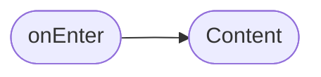

# Выбор гостей

**ID:** BS-04  
**Тип:** Bottom Sheet  
**Домен:** 04. Компоненты  
**Приоритет:** Medium  
**Статус:** Готов к дизайну  
**Функциональные блоки:** FB-04-001, FB-04-002  
**Зона авторизации:** АЗ  
**Дизайн-макет:** [Figma](https://figma.com) — версия 1.0

---

## Содержание

- [История изменений](#история-изменений)
- [Обзор](#обзор)
- [Навигация](#навигация)
- [Входные данные](#входные-данные)
- [Применяемые логики](#применяемые-логики)
- [Свойства Bottom Sheet](#свойства-bottom-sheet)
- [Инициализация](#инициализация)
- [Используемые запросы](#используемые-запросы)
- [Макет экрана](#макет-экрана)
- [Элементы экрана](#элементы-экрана)
- [Состояния экрана](#состояния-экрана)
- [Действия пользователя](#действия-пользователя)
- [Связанные требования](#связанные-требования)
- [Критерии приёмки](#критерии-приёмки)

---

## История изменений

| Релиз | ТЗ | Описание изменений |
|-------|-----|-------------------|
| 1.0.0 | BS-04 | Первая версия ТЗ |

---

## Обзор

Bottom Sheet для добавления гостей (0-2 человека) к бронированию. Пользователь может увеличить или уменьшить количество гостей.

### User Story

> Как **посетитель скалодрома**, я хочу **добавить гостей к бронированию**, чтобы **записать друзей на совместную тренировку**.

### Бизнес-ценность

- Увеличение количества посетителей через приглашённых гостей
- Гибкость бронирования для групп
- Прозрачность информации о количестве участников

---

## Навигация

### Входящая (откуда открывается)

| Источник | Триггер | Условие | Передаваемые параметры |
|----------|---------|---------|------------------------|
| [SCR-05 Выбор слота](SCR-05_Выбор_слота.md) | Тап на «Добавить гостей» | Всегда | `{slot}`, `{price}` |
| [SCR-06 Детали бронирования](SCR-06_Детали_бронирования.md) | Тап на «Изменить» | Если поддерживается | `{bookingId}` |

### Исходящая (куда ведёт)

| Назначение | Триггер | Передаваемые параметры |
|------------|---------|------------------------|
| [SCR-05 Выбор слота](SCR-05_Выбор_слота.md) | Успешное добавление | `{guestsCount}`, `{updatedPrice}` |
| [SCR-06 Детали бронирования](SCR-06_Детали_бронирования.md) | Успешное обновление | `{bookingId}` |

---

## Входные данные

| Название | Тип | Возможные значения | Описание |
|----------|-----|-------------------|----------|
| `slot` | Параметр навигации | Объект | Данные слота |
| `basePrice` | Параметр навигации | number | Базовая цена |
| `guestPrice` | Конфиг | number | Цена за гостя |
| `maxGuests` | Конфиг | 2 | Максимум гостей |
| `currentGuests` | Состояние | 0-2 | Текущее количество гостей |
| `availableSlots` | Состояние | number | Доступные места |

---

## Применяемые логики

> *Секция опциональна. Указывать, если на экране используется переиспользуемая бизнес-логика из раздела [Логики](Логики/_INDEX.md).*

---

## Свойства Bottom Sheet

| Свойство | Значение |
|----------|----------|
| Высота | Динамическая (max 60vh) |
| Закрытие свайпом | Да |
| Закрытие по тапу вне области | Да |
| Затемнение фона | Да |
| Кнопка закрытия | Да (справа в header) |
| Corner radius (верх) | 24px |

---

## Инициализация

> **Примечание:** При открытии экрана не отправляются запросы. Данные передаются из предыдущего экрана или берутся из конфигурации.

### Диаграмма загрузки



### Запросы при открытии

| № | Запрос | Критичный | Зависит от | Условие |
|---|--------|-----------|------------|---------|
| 1 | — | — | — | Нет запросов |

---

## Используемые запросы

### PATCH /bookings/{bookingId}

**Тип:** REST  
**Метод:** PATCH  
**Спецификация:** `bookings.yaml` → `updateBooking`

**Триггер:** Тап на кнопку «Добавить» (при редактировании)

**Параметры:**

| Параметр | Тип | Обязательность | Источник | Описание |
|----------|-----|----------------|----------|----------|
| `bookingId` | string | Да | Входные данные | ID бронирования |
| `guestsCount` | int | Да | UI | Количество гостей |

**Обработка ответа:**

| Результат | Условие | UI-реакция |
|-----------|---------|------------|
| Загрузка | — | Лоадер на кнопке, блокировка UI |
| Успех | — | Закрыть BS, обновить данные |
| HTTP 4xx | — | Снек с текстом ошибки |
| HTTP 5xx | — | Снек «Произошла ошибка. Попробуйте позже» |
| Сеть | Нет соединения | Снек «Нет соединения. Проверьте подключение» |

---

## Макет экрана

### Структура

```
┌─────────────────────────────────────┐
│          ─────────────              │  ← Handle (декоративный)
│                                 [X] │  ← Header
├─────────────────────────────────────┤
│                                     │
│     Добавить гостей                 │  ← Scrollable
│                                     │
│     Количество гостей               │
│                                     │
│        [ - ]      1      [ + ]     │
│                                     │
│     Вы можете взять с собой         │
│     до 2 гостей                     │
│                                     │
│     Цена за гостя: 500 ₽            │  ← (conditional)
│                                     │
├─────────────────────────────────────┤
│            [Добавить]               │  ← Fixed Bottom
└─────────────────────────────────────┘
```

### Компоненты

| Компонент | Описание | Обязательность |
|-----------|----------|----------------|
| Handle | Декоративная линия | Да |
| Header | Заголовок с кнопкой закрытия | Да |
| Счётчик | Counter с кнопками +/- | Да |
| Подсказка | Текст с лимитом | Да |
| Блок цены | Цена за гостя (conditional) | Опционально |
| Footer | Кнопка действия | Да |

---

## Элементы экрана

> **Примечания:**
> - **Колонка "Валидация":** Для полей ввода указать правило и текст ошибки. Для остальных элементов — "—".
> - **Логика:** Описывается после таблицы каждого блока в виде текстового блока "**Логика:**". Если элемент использует переиспользуемую логику из раздела [Логики](Логики/_INDEX.md), укажите ссылку на неё.
> - **Условия доступности:** Для кнопок и интерактивных элементов указать условия активности/видимости после таблицы.

### 1. Header

| Элемент | Описание | Источник данных | Валидация | Действие |
|---------|----------|-----------------|-----------|----------|
| Декоративный handle | Линия | Статический | — | — |
| Заголовок | Текст «Добавить гостей» | Статический | — | — |
| Кнопка закрытия | Иконка ✕ | — | — | Закрыть Bottom Sheet |

### 2. Основной контент

| Элемент | Описание | Источник данных | Валидация | Действие |
|---------|----------|-----------------|-----------|----------|
| Подзаголовок | Текст «Количество гостей» | Статический | — | — |
| Счётчик | Кнопка «-», значение, «+» | `currentGuests` из состояния | — | Изменение значения |
| Подсказка | Текст | Статический | — | — |
| Цена за гостя | Текст | `guestPrice` из конфига | — | — |

**Логика:**
- Счётчик: [LOGIC-005](../Логики/LOGIC-005_Counter.md) — изменение значения с ограничениями
- Расчёт итоговой цены: `basePrice + (guests * guestPrice)`
- Минимум гостей: 0
- Максимум гостей: 2 (или `availableSlots`, если меньше)

**Условия доступности:**
- Кнопка «-» активна, если: `currentGuests > 0`
- Кнопка «+» активна, если: `currentGuests < maxGuests` И `currentGuests < availableSlots`
- Блок «Цена за гостя» виден, если: `guestPrice > 0`

### 3. Footer

| Элемент | Описание | Источник данных | Валидация | Действие |
|---------|----------|-----------------|-----------|----------|
| Кнопка «Добавить» | Primary Button | — | — | Сохранение → закрытие |

**Логика:**
- Кнопка «Добавить»: При тапе сохраняет значение guestsCount и закрывает BS

**Условия доступности:**
- Кнопка «Добавить» активна, если: всегда (даже при 0 гостей)

---

## Состояния экрана

### Таблица состояний

| Состояние | Условие | Отображение |
|-----------|---------|-------------|
| Начальное | Открытие BS | Значение 0 |
| 0 гостей | `currentGuests = 0` | Кнопка «-» disabled |
| 1-2 гостя | `currentGuests = 1 или 2` | Обе кнопки active |
| Максимум | `currentGuests = maxGuests` | Кнопка «+» disabled |
| Без доплаты | `guestPrice = 0` | Блок цены скрыт |
| С доплатой | `guestPrice > 0` | Показан блок цены |
| Сохранение | Отправка PATCH | Лоадер на кнопке |


## Действия пользователя

| Действие | Элемент | Триггер | Результат |
|----------|---------|---------|-----------|
| Закрыть | Кнопка ✕ | Tap | Закрытие Bottom Sheet |
| Закрыть | Backdrop | Tap | Закрытие Bottom Sheet |
| Закрыть | Свайп вниз | Swipe | Закрытие Bottom Sheet |
| Уменьшить | Кнопка «-» | Tap | `currentGuests - 1` |
| Увеличить | Кнопка «+» | Tap | `currentGuests + 1` |
| Сохранить | Кнопка «Добавить» | Tap | Сохранение, закрытие |

---

## Связанные требования

### Функциональные (REQ-FUNC-*)

| ID | Название | Приоритет |
|----|----------|-----------|
| FT-12 | Добавление гостей к бронированию | Medium |
| FT-13 | Ограничение количества гостей (до 2) | Medium |

---

## Критерии приёмки

### Позитивные сценарии

| ID | Критерий | Приоритет |
|----|----------|-----------|
| AC-001 | **Дано** пользователь на экране выбора слота, **Когда** нажимает «Добавить гостей», **Тогда** открывается Bottom Sheet | P0 |
| AC-002 | **Дано** BS открыт, **Когда** нажимает «+», **Тогда** значение увеличивается на 1 | P0 |
| AC-003 | **Дано** BS открыт, **Когда** нажимает «Добавить», **Тогда** BS закрывается и значение сохраняется | P0 |
| AC-004 | **Дано** 0 гостей, **Когда** нажатие «-», **Тогда** кнопка неактивна | P1 |

### Негативные сценарии

| ID | Критерий | Приоритет |
|----|----------|-----------|
| AC-N01 | **Дано** достигнут максимум гостей, **Когда** нажатие «+», **Тогда** кнопка неактивна | P0 |
| AC-N02 | **Дано** ошибка сети при сохранении, **Когда** нажатие «Добавить», **Тогда** снек об ошибке | P1 |

### Граничные условия (Edge Cases)

| ID | Критерий | Приоритет |
|----|----------|-----------|
| AC-E01 | **Дано** доступно меньше 2 мест, **Когда** открытие BS, **Тогда** максимум ограничивается доступными местами | P1 |
| AC-E02 | **Дано** guestPrice = 0, **Когда** открытие BS, **Тогда** блок цены скрыт | P1 |