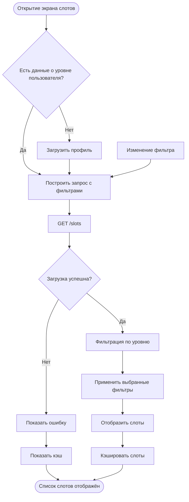

# Просмотр и фильтрация слотов

**ID:** LOGIC-02  
**Тип:** Логика  
**Домен:** 09. Логики  
**Приоритет:** Critical  
**Статус:** Черновик  
**Функциональные блоки:** FB-SLOTS-001, FB-SLOTS-002

---

## История изменений

| Релиз | ТЗ | Описание изменений |
|-------|-----|-------------------|
| — | — | Первоначальная документация |

---

## Входные данные

| Название | Тип | Возможные значения | Описание |
|----------|-----|-------------------|----------|
| `userLevel` | Состояние | `beginner`, `intermediate`, `advanced` | Уровень пользователя для фильтрации |
| `cachedSlots` | Локальный кэш | Массив слотов | Кэш слотов для офлайн-режима |
| `filters` | Состояние | `{zone, date, instructorId}` | Текущие выбранные фильтры |

---

## Обзор

Логика получения и отображения доступных слотов тренировок с возможностью фильтрации по зоне, дате и инструктору. По умолчанию показываются слоты на ближайшие 7 дней. Для новичков отображаются только слоты болдеринга.

### User Story

> Как клиент скалодрома, я хочу видеть доступные тренировки и фильтровать их по зоне, дате и инструктору, чтобы быстро найти подходящее время для тренировки.

### Бизнес-ценность

- Быстрый поиск доступных слотов
- Фильтрация по релевантным параметрам
- Автоматическая адаптация под уровень пользователя
- Кэширование для быстрой загрузки

---

## Точки применения

| Экран/Компонент | Элемент/Триггер | Условие |
|-----------------|-----------------|---------|
| Главный экран | При открытии вкладки "Тренировки" | Всегда |
| Экран слотов | Изменение фильтров | Всегда |
| Экран деталей слота | Тап на слот | Всегда |

---

## Флоу

---

## Описание логики

### Шаг 1: Загрузка профиля

При открытии экрана слотов получаем данные о уровне пользователя. Если уровень не определён — загружаем профиль.

### Шаг 2: Построение запроса

Формируем параметры запроса:
- zone: boulder/rope/all (по умолчанию all)
- date: конкретная дата или диапазон
- instructorId: UUID инструктора
- onlyAvailable: true (скрыть полные слоты)
- Для новичков: zone=boulder принудительно

### Шаг 3: Загрузка слотов

Отправляем GET запрос на /slots с параметрами. При ошибке используем кэш.

### Шаг 4: Отображение

Отображаем слоты в виде карточек с информацией:
- Время начала/конца
- Зона (болдеринг/трассы)
- Инструктор
- Свободные места / всего мест
- Цена

---

## API запросы

### GET /slots

**Триггер:** Открытие экрана, изменение фильтров

**Headers:**

| Поле | Описание |
|------|----------|
| authorization | Bearer токен пользователя |
| deviceuuid | ID устройства |

**Параметры:**

| Параметр | Тип | Описание | Значение/Источник |
|----------|-----|----------|-------------------|
| zone | string | Фильтр по зоне | Из выпадающего списка (boulder/rope/all) |
| date | string | Фильтр по дате | Из календаря (YYYY-MM-DD) |
| dateFrom | string | Начало диапазона | При выборе диапазона |
| dateTo | string | Конец диапазона | При выборе диапазона |
| instructorId | string | Фильтр по инструктору | Из списка инструкторов |
| onlyAvailable | boolean | Только со свободными местами | Всегда true |
| page | integer | Номер страницы | 1 |
| limit | integer | Количество | 20 |

**Обработка ответа:**

| Результат | Действие |
|-----------|----------|
| Загрузка | Показ скелетона списка |
| Успех (200) | Отображение слотов, сохранение в кэш |
| Ошибка 401 | Перенаправление на авторизацию |
| Ошибка 5xx | Снек "Ошибка загрузки", показать кэш |
| Ошибка сети | Снек "Нет соединения", показать кэш |

---

### GET /zones

**Триггер:** Загрузка списка зон для фильтра

**Headers:**

| Поле | Описание |
|------|----------|
| authorization | Bearer токен (опционально) |
| deviceuuid | ID устройства |

**Параметры:** Нет

**Обработка ответа:**

| Результат | Действие |
|-----------|----------|
| Успех (200) | Заполнить выпадающий список зон |
| Ошибка | Показать дефолтные значения (boulder, rope) |

---

### GET /instructors

**Триггер:** Загрузка списка инструкторов для фильтра

**Headers:**

| Поле | Описание |
|------|----------|
| authorization | Bearer токен (опционально) |
| deviceuuid | ID устройства |

**Параметры:** Нет

**Обработка ответа:**

| Результат | Действие |
|-----------|----------|
| Успех (200) | Заполнить список инструкторов с рейтингами |
| Ошибка | Показать пустой список |

---

### GET /slots/{slotId}

**Триггер:** Тап на слот

**Headers:**

| Поле | Описание |
|------|----------|
| authorization | Bearer токен |
| deviceuuid | ID устройства |

**Параметры:**
| Параметр | Тип | Описание |
|----------|-----|----------|
| slotId | string | UUID слота |

**Обработка ответа:**

| Результат | Действие |
|-----------|----------|
| Успех (200) | Переход на экран деталей слота |
| Ошибка 404 | Снек "Слот не найден" |
| Ошибка 410 | Снек "Тренировка отменена", возврат к списку |

---

## Локальное хранение

| Ключ | Тип хранения | Описание |
|------|--------------|----------|
| `cached_slots` | Локальный кэш | Массив последних загруженных слотов |
| `slot_filters` | Локальный кэш | Текущие выбранные фильтры |
| `zones_cache` | Локальный кэш | Список зон |
| `instructors_cache` | Локальный кэш | Список инструкторов |

---

## Связанные требования

### Функциональные (REQ-FUNC-*)

| ID | Название | Приоритет |
|----|----------|-----------|
| REQ-FUNC-SLOTS-001 | Просмотр доступных слотов | Critical |
| REQ-FUNC-SLOTS-002 | Фильтрация слотов | High |
| REQ-FUNC-SLOTS-003 | Просмотр деталей слота | High |

### Интеграции (REQ-INT-*)

| ID | Название | Приоритет |
|----|----------|-----------|
| REQ-INT-API-002 | Интеграция с Slots API | Critical |
| REQ-INT-API-003 | Интеграция с Zones API | High |
| REQ-INT-API-004 | Интеграция с Instructors API | High |

### UI (REQ-UI-*)

| ID | Название | Приоритет |
|----|----------|-----------|
| REQ-UI-SLOTS-001 | Карточка слота | Critical |
| REQ-UI-SLOTS-002 | Панель фильтров | High |
| REQ-UI-SLOTS-003 | Состояние загрузки | High |

### Данные (REQ-DATA-*)

| ID | Название | Приоритет |
|----|----------|-----------|
| REQ-DATA-SLOTS-001 | Кэширование слотов | High |
| REQ-DATA-SLOTS-002 | Хранение фильтров | Medium |

---

## Критерии приёмки

| ID | Критерий |
|----|----------|
| AC-001 | **Дано** Пользователь открывает экран слотов, **Когда** Загружаются слоты на ближайшие 7 дней, **Тогда** Отображаются только слоты со свободными местами |
| AC-002 | **Дано** Пользователь с уровнем beginner, **Когда** Он открывает экран слотов, **Тогда** Показываются только слоты болдеринга |
| AC-003 | **Дано** Пользователь выбирает фильтр по зоне "Трассы", **Когда** Он нажимает применить, **Тогда** Показываются только слоты с верёвкой |
| AC-004 | **Дано** Пользователь выбирает дату, **Когда** Он применяет фильтр, **Тогда** Показываются слоты только на выбранную дату |
| AC-005 | **Дано** Пользователь выбирает инструктора, **Когда** Он применяет фильтр, **Тогда** Показываются слоты только этого инструктора |
| AC-006 | **Дано** Список пуст (нет слотов по фильтрам), **Когда** Пользователь открывает экран, **Тогда** Показывается состояние "Нет доступных тренировок" |

---

## Обработка ошибок

| Тип ошибки | Контекст | Действие |
|------------|----------|----------|
| Ошибка сети | Загрузка слотов | Показать кэш + снек |
| 401 Unauthorized | Загрузка слотов | Перенаправить на авторизацию |
| Слот отменён | Просмотр деталей | Показать сообщение, вернуть к списку |
| Пустой результат | Загрузка слотов | Показать состояние пустоты |